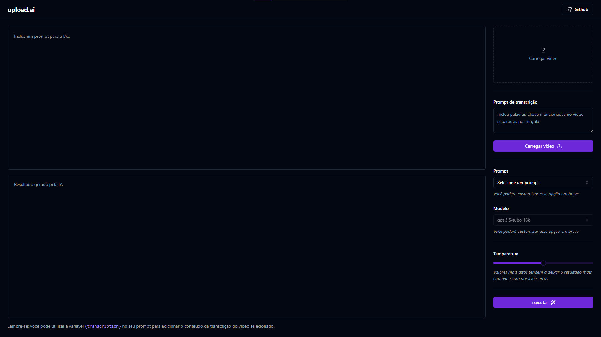

# Transcription AI
<p align="center">

  
</p>

## 🚀 Instalando Transcription AI

Para instalar o Transcription AI, siga estas etapas:

Clonar projeto:

```
git clone https://github.com/rom013/transcription_ia.git
```

Instalar pacotes de dependências:

```
npm install
```

Executar aplicação:

```
npm run dev
```

## ☕ Usando

Para usar transcription ai, siga estas etapas:

1. Escolha um vídeo, de preferência curto;
2. Insira sobre o principal assunto do vídeo em: "Prompt de transcrição";
3. Escolha o prompt em "Prompt";
4. Escolha qual o modelo do chat gpt você quer
5. Escolha qual a temperatura da geração (valores mais altos tendem a deixar o resultado mais criativo e com possíveis erros)
6. Agora execute a transcrição e aguarde a mágica acontecer (se o vídeo for muito longo a transcrição pode demorar)

***
⚠ Esse repositório é a versão front-end da aplicação, lembre-se de executar o back-end antes de executar esse. [api-transcription-ai](https://github.com/rom013/api-transcription-ai)
***

## 📫 Contribuindo para transcription ai

Para contribuir com transcription ai, siga estas etapas:

1. Bifurque este repositório.
2. Crie um branch: `git checkout -b <nome_branch>`.
3. Faça suas alterações e confirme-as: `git commit -m '<mensagem_commit>'`
4. Envie para o branch original: `git push origin transcription ai / <local>`
5. Crie a solicitação de pull.

Como alternativa, consulte a documentação do GitHub em [como criar uma solicitação pull](https://help.github.com/en/github/collaborating-with-issues-and-pull-requests/creating-a-pull-request).
